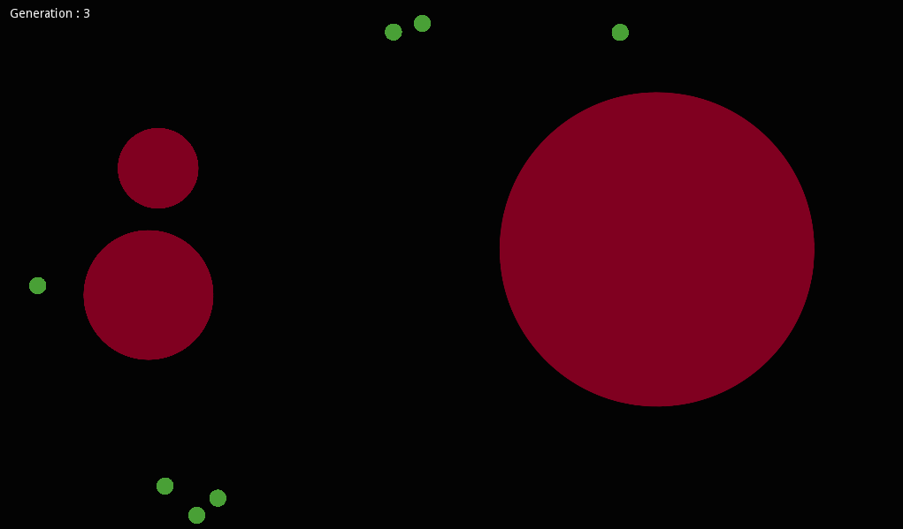

# Evolution Simulator

This project attempts to explore and provide a simple implementation of
the main principles of genetic algorithms. These principles being
population, selection and mutation.

[Visit the website for a video demo and a general overview](https://naymat.github.io/Evolution-Simulator/)



## How to run

To run this program you will have to install the [game engine Godot](https://godotengine.org/download/). You will need to download this git repository and store it on your local drive.

### GUI

To run using the GUI, first open up the Godot or Godot-mono application. Then import this application by selecting the "project.godot" in the "Evolution Sim" directory.

Once the project is imported you can run the program by selecting it and clicking run. You also have the option of editing the project and testing it using the edit button.

### Terminal

To run this project using the command line, cd to the directory to the directory of the project on your local drive

```sh
cd 'Evolution Sim'
godot
```

or if you have the mono version:

```sh
cd 'Evolution Sim'
godot-mono
```
